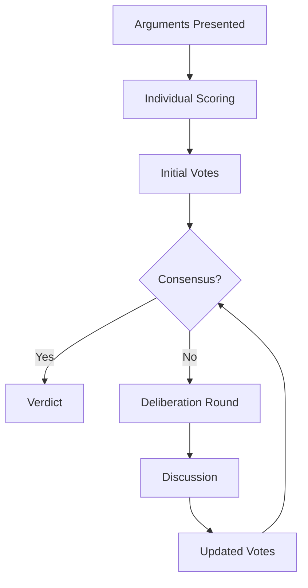

# Jury Mechanism

ARTEMIS uses a multi-perspective jury system instead of a single evaluator. This provides more balanced verdicts and transparent decision-making.

## Why a Jury?

Single-evaluator systems have limitations:

- **Bias**: One perspective dominates
- **Opacity**: Hard to understand decisions
- **Inconsistency**: Results vary unpredictably

A jury addresses these by:

- **Multiple Perspectives**: Different viewpoints considered
- **Deliberation**: Jurors discuss before deciding
- **Transparency**: Each vote is explained

## Jury Composition

### Basic Jury

```python
from artemis.core.jury import Jury, JuryMember

jury = Jury(
    members=[
        JuryMember(name="logical", perspective="values logical consistency"),
        JuryMember(name="ethical", perspective="values ethical considerations"),
        JuryMember(name="practical", perspective="values practical implications"),
    ]
)
```

### Jury Member Perspectives

Different perspectives emphasize different criteria:

| Perspective | Primary Focus | Weight Adjustments |
|-------------|---------------|-------------------|
| `logical` | Argument structure | +logic, -emotion |
| `ethical` | Moral implications | +ethics, -efficiency |
| `practical` | Real-world impact | +evidence, -theory |
| `analytical` | Data and facts | +evidence, +causal |
| `empathetic` | Human impact | +ethics, +argument |

### Custom Perspectives

```python
from artemis.core.jury import JuryMember, Perspective

custom_perspective = Perspective(
    name="scientific",
    description="Values empirical evidence and scientific methodology",
    criteria_adjustments={
        "evidence_quality": 1.5,  # 50% more weight
        "causal_validity": 1.3,
        "ethical_considerations": 0.8,
    },
    required_evidence=["peer_reviewed", "empirical"],
)

juror = JuryMember(
    name="scientist",
    perspective=custom_perspective,
)
```

## Deliberation Process

### Flow



### Stages

1. **Individual Scoring**: Each juror scores arguments independently
2. **Initial Votes**: Jurors cast preliminary votes
3. **Deliberation**: If no consensus, jurors exchange reasoning
4. **Updated Votes**: Jurors can change votes based on deliberation
5. **Final Verdict**: Decision is made

### Configuration

```python
from artemis.core.types import JuryConfig

config = JuryConfig(
    size=5,
    require_unanimous=False,
    majority_threshold=0.6,  # 60% agreement needed
    max_deliberation_rounds=3,
    allow_abstention=True,
)
```

## Voting Mechanisms

### Simple Majority

```python
jury = Jury(
    members=members,
    voting="simple_majority",  # >50% wins
)
```

### Supermajority

```python
jury = Jury(
    members=members,
    voting="supermajority",
    threshold=0.67,  # 2/3 required
)
```

### Unanimous

```python
jury = Jury(
    members=members,
    voting="unanimous",  # All must agree
)
```

### Weighted Voting

```python
from artemis.core.jury import WeightedJury

jury = WeightedJury(
    members=[
        JuryMember(name="expert", perspective="domain_expert", weight=2.0),
        JuryMember(name="generalist", perspective="balanced", weight=1.0),
        JuryMember(name="contrarian", perspective="skeptical", weight=1.0),
    ]
)
```

## Verdict Structure

### Basic Verdict

```python
verdict = await jury.deliberate(debate_result)

print(f"Decision: {verdict.decision}")  # "pro", "con", or "tie"
print(f"Confidence: {verdict.confidence}")  # 0.0 to 1.0
print(f"Reasoning: {verdict.reasoning}")
```

### Detailed Verdict

```python
# Access individual votes
for vote in verdict.votes:
    print(f"Juror: {vote.juror}")
    print(f"Vote: {vote.decision}")
    print(f"Confidence: {vote.confidence}")
    print(f"Reasoning: {vote.reasoning}")
    print("---")

# Deliberation history
for round in verdict.deliberation_history:
    print(f"Round {round.number}:")
    print(f"  Discussion: {round.discussion}")
    print(f"  Vote changes: {round.changes}")
```

### Verdict Metadata

```python
print(f"Deliberation rounds: {verdict.rounds_needed}")
print(f"Was unanimous: {verdict.was_unanimous}")
print(f"Margin: {verdict.margin}")
print(f"Abstentions: {verdict.abstention_count}")
```

## Deliberation Dynamics

### Sharing Reasoning

During deliberation, jurors share their reasoning:

```python
# Internal deliberation process
class DeliberationRound:
    async def execute(self, jury: Jury, current_votes: list[Vote]) -> list[Vote]:
        # Each juror sees other votes and reasoning
        shared_reasoning = [
            f"{vote.juror}: {vote.reasoning}"
            for vote in current_votes
        ]

        # Jurors can update their position
        updated_votes = []
        for juror in jury.members:
            new_vote = await juror.reconsider(
                own_vote=juror.current_vote,
                other_reasoning=shared_reasoning,
            )
            updated_votes.append(new_vote)

        return updated_votes
```

### Convergence Tracking

```python
# Track how votes change during deliberation
for round in verdict.deliberation_history:
    print(f"Round {round.number}:")
    print(f"  Agreement: {round.agreement_level:.0%}")
    print(f"  Changes: {round.vote_changes}")
```

## Using the Jury

### In Debates

```python
from artemis.core.debate import Debate
from artemis.core.jury import Jury, JuryMember

# Create jury
jury = Jury(
    members=[
        JuryMember(name="j1", perspective="logical"),
        JuryMember(name="j2", perspective="ethical"),
        JuryMember(name="j3", perspective="practical"),
    ]
)

# Create debate with jury
debate = Debate(
    topic="Should we adopt this policy?",
    agents=agents,
    jury=jury,
)

result = await debate.run()
print(f"Verdict: {result.verdict}")
```

### Standalone Jury

```python
from artemis.core.jury import Jury
from artemis.core.types import DebateTranscript

# Use jury to evaluate existing arguments
transcript = DebateTranscript(...)

verdict = await jury.evaluate(transcript)
```

## Jury Perspectives

### Built-in Perspectives

ARTEMIS includes several built-in perspectives:

```python
from artemis.core.jury import PERSPECTIVES

# Available perspectives
print(PERSPECTIVES.keys())
# ['logical', 'ethical', 'practical', 'analytical',
#  'empathetic', 'skeptical', 'creative', 'conservative']

# Use a built-in perspective
juror = JuryMember(
    name="logic_juror",
    perspective=PERSPECTIVES["logical"],
)
```

### Perspective Details

**Logical Perspective**:
- Prioritizes valid reasoning
- Detects logical fallacies
- Values internal consistency

**Ethical Perspective**:
- Considers moral implications
- Weighs stakeholder impact
- Values fairness and justice

**Practical Perspective**:
- Focuses on feasibility
- Considers implementation
- Values real-world evidence

**Skeptical Perspective**:
- Questions all claims
- Requires strong evidence
- Identifies weak points

## Advanced Configuration

### Model-Backed Jurors

```python
from artemis.core.jury import ModelJuryMember

# Juror backed by a specific model
expert_juror = ModelJuryMember(
    name="expert",
    perspective="domain_expert",
    model="gpt-4o",
    temperature=0.3,  # More deterministic
)

# Different model for different perspective
creative_juror = ModelJuryMember(
    name="creative",
    perspective="creative",
    model="claude-3-opus",
    temperature=0.8,  # More creative
)
```

### Jury Presets

```python
from artemis.core.jury import create_jury

# Balanced jury (default)
balanced = create_jury(preset="balanced", size=3)

# Technical jury
technical = create_jury(preset="technical", size=5)

# Ethical jury
ethical = create_jury(preset="ethical", size=3)
```

## Benefits of Jury System

### 1. Reduced Bias

Multiple perspectives prevent single-viewpoint dominance.

### 2. Transparent Decisions

Each vote and reasoning is recorded and explainable.

### 3. Robust Verdicts

Deliberation process improves decision quality.

### 4. Configurable Fairness

Voting mechanisms can be tuned for different needs.

## Next Steps

- Learn about [L-AE-CR Evaluation](l-ae-cr.md) that feeds jury scores
- Understand [H-L-DAG Arguments](h-l-dag.md) that juries evaluate
- Explore [Ethics Module](ethics.md) for ethical jury perspectives
