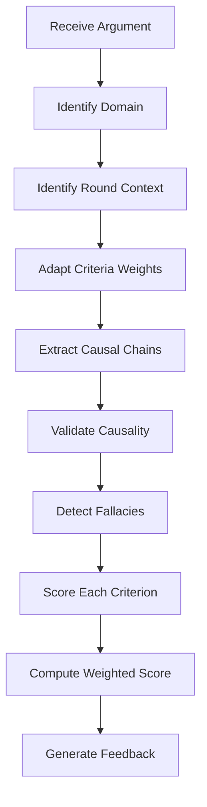

# L-AE-CR: Adaptive Evaluation with Causal Reasoning

L-AE-CR (Leveled Adaptive Evaluation with Causal Reasoning) is ARTEMIS's dynamic evaluation system. Unlike static scoring, it adapts evaluation criteria based on context and traces causal relationships in arguments.

## Core Principles

### 1. Adaptive Criteria Weighting

Evaluation criteria aren't fixed—they shift based on:

- **Topic Domain**: Technical vs. ethical vs. policy debates
- **Round Context**: Opening statements vs. rebuttals
- **Argument Type**: Evidence-based vs. logical vs. emotional appeals

### 2. Causal Chain Analysis

Arguments are evaluated not just on content but on the strength of causal reasoning:

- Does A actually cause B?
- Is the causal chain complete?
- Are there gaps or logical fallacies?

## Evaluation Criteria

### Standard Criteria

| Criterion | Description | Base Weight |
|-----------|-------------|-------------|
| `logical_coherence` | Internal consistency of argument | 0.25 |
| `evidence_quality` | Strength and relevance of evidence | 0.25 |
| `argument_strength` | Overall persuasiveness | 0.20 |
| `ethical_considerations` | Ethical soundness | 0.15 |
| `causal_validity` | Strength of causal reasoning | 0.15 |

### Domain-Specific Adaptations

```python
from artemis.core.evaluation import AdaptiveEvaluator

evaluator = AdaptiveEvaluator()

# Technical domain: higher evidence weight
technical_weights = evaluator.adapt_for_domain("technical")
# {
#     "logical_coherence": 0.30,
#     "evidence_quality": 0.35,
#     "argument_strength": 0.15,
#     "ethical_considerations": 0.10,
#     "causal_validity": 0.10,
# }

# Ethical domain: higher ethics weight
ethical_weights = evaluator.adapt_for_domain("ethical")
# {
#     "logical_coherence": 0.20,
#     "evidence_quality": 0.15,
#     "argument_strength": 0.20,
#     "ethical_considerations": 0.35,
#     "causal_validity": 0.10,
# }
```

## Round-Context Adaptation

Different rounds have different expectations:

### Opening Round

```python
opening_weights = evaluator.adapt_for_round(
    round_type="opening",
    round_number=1,
)
# Focus on thesis clarity and position establishment
```

### Rebuttal Rounds

```python
rebuttal_weights = evaluator.adapt_for_round(
    round_type="rebuttal",
    round_number=3,
)
# Focus on counter-argument effectiveness and evidence refutation
```

### Closing Round

```python
closing_weights = evaluator.adapt_for_round(
    round_type="closing",
    round_number=5,
)
# Focus on synthesis and overall argument coherence
```

## Causal Reasoning Analysis

### Causal Chain Validation

```python
from artemis.core.types import CausalChain, CausalLink

chain = CausalChain(
    links=[
        CausalLink(
            source="increased_regulation",
            target="reduced_innovation_speed",
            relation="CAUSES",
            strength=0.7,
        ),
        CausalLink(
            source="reduced_innovation_speed",
            target="competitive_disadvantage",
            relation="CAUSES",
            strength=0.5,
        ),
    ]
)

# Evaluate chain validity
validity = evaluator.validate_causal_chain(chain)
# {
#     "is_valid": True,
#     "overall_strength": 0.35,  # 0.7 * 0.5
#     "weak_links": ["reduced_innovation_speed -> competitive_disadvantage"],
#     "missing_evidence": ["innovation speed metrics"],
# }
```

### Detecting Causal Fallacies

L-AE-CR detects common causal fallacies:

| Fallacy | Description | Detection Method |
|---------|-------------|------------------|
| Post Hoc | Assumes causation from sequence | Temporal analysis |
| Correlation | Treats correlation as causation | Statistical checks |
| Single Cause | Ignores multiple factors | Complexity analysis |
| Slippery Slope | Assumes inevitable escalation | Chain strength analysis |

```python
# Detect fallacies in an argument
fallacies = evaluator.detect_causal_fallacies(argument)

for fallacy in fallacies:
    print(f"Type: {fallacy.type}")
    print(f"Location: {fallacy.claim}")
    print(f"Severity: {fallacy.severity}")
    print(f"Suggestion: {fallacy.correction}")
```

## Evaluation Flow



## Using L-AE-CR

### Basic Evaluation

```python
from artemis.core.evaluation import AdaptiveEvaluator

evaluator = AdaptiveEvaluator(
    domain="policy",
    enable_causal_analysis=True,
)

result = await evaluator.evaluate(
    argument=argument,
    context=debate_context,
)

print(f"Total Score: {result.total_score:.2f}")
print(f"Breakdown:")
for criterion, score in result.scores.items():
    print(f"  {criterion}: {score:.2f}")
```

### Detailed Feedback

```python
result = await evaluator.evaluate(
    argument=argument,
    context=debate_context,
    include_feedback=True,
)

print(f"Strengths: {result.feedback.strengths}")
print(f"Weaknesses: {result.feedback.weaknesses}")
print(f"Suggestions: {result.feedback.suggestions}")
print(f"Causal Issues: {result.feedback.causal_issues}")
```

### Comparative Evaluation

```python
comparison = await evaluator.compare(
    argument_a=pro_argument,
    argument_b=con_argument,
    context=debate_context,
)

print(f"Winner: {comparison.winner}")
print(f"Margin: {comparison.margin:.2f}")
print(f"Key Differentiators: {comparison.differentiators}")
```

## Score Components

### Logical Coherence Score

Evaluates internal consistency:

- Premises support conclusion
- No contradictions
- Valid inference patterns

### Evidence Quality Score

Evaluates supporting evidence:

- Source credibility
- Relevance to claims
- Recency and accuracy
- Diversity of sources

### Argument Strength Score

Evaluates persuasiveness:

- Clarity of thesis
- Effectiveness of rhetoric
- Audience appropriateness
- Counter-argument handling

### Ethical Considerations Score

Evaluates ethical soundness:

- Fairness of reasoning
- Consideration of stakeholders
- Avoidance of harmful claims
- Respect for values

### Causal Validity Score

Evaluates causal reasoning:

- Chain completeness
- Link strength
- Evidence for causation
- Fallacy absence

## Configuration

### Customizing Evaluation

```python
from artemis.core.types import EvaluationConfig

config = EvaluationConfig(
    # Custom weights
    criteria_weights={
        "logical_coherence": 0.3,
        "evidence_quality": 0.3,
        "argument_strength": 0.2,
        "ethical_considerations": 0.1,
        "causal_validity": 0.1,
    },

    # Causal analysis settings
    min_causal_strength=0.3,
    require_evidence_for_causal=True,

    # Feedback settings
    include_suggestions=True,
    suggestion_count=3,
)

evaluator = AdaptiveEvaluator(config=config)
```

### Domain Profiles

```python
from artemis.core.evaluation import DomainProfile

# Create custom domain profile
scientific_profile = DomainProfile(
    name="scientific",
    weights={
        "evidence_quality": 0.40,
        "logical_coherence": 0.25,
        "causal_validity": 0.20,
        "argument_strength": 0.10,
        "ethical_considerations": 0.05,
    },
    required_evidence_types=["empirical", "peer_reviewed"],
    causal_requirements=["statistical_significance"],
)

evaluator = AdaptiveEvaluator(domain_profile=scientific_profile)
```

## Integration with Jury

L-AE-CR provides scores to the jury mechanism:

```python
# Each jury member receives evaluation results
for juror in jury.members:
    evaluation = await evaluator.evaluate(
        argument=argument,
        context=debate_context,
        perspective=juror.perspective,
    )
    juror.consider(evaluation)
```

## Benefits of L-AE-CR

### 1. Context-Aware Evaluation

- Adapts to topic domain automatically
- Adjusts for round context
- Considers argument type

### 2. Transparent Scoring

- Clear criteria breakdown
- Weighted contributions visible
- Feedback explains scores

### 3. Causal Rigor

- Validates causal claims
- Detects logical fallacies
- Measures chain strength

### 4. Actionable Feedback

- Specific improvement suggestions
- Identifies weak points
- Highlights strengths

## Next Steps

- See how evaluations feed into the [Jury Mechanism](jury.md)
- Learn about [H-L-DAG](h-l-dag.md) argument structure
- Explore [Safety Monitoring](../safety/overview.md) integration
